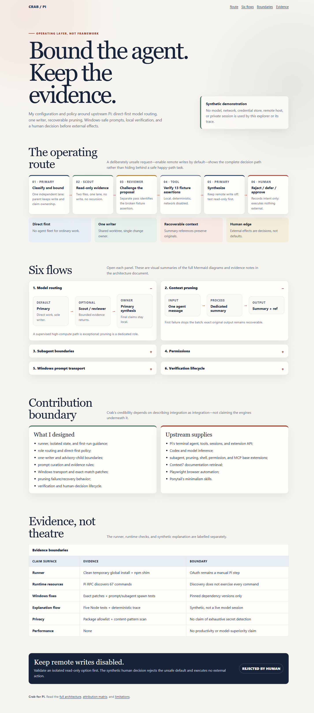

# Crab

> I wanted a coding agent that could do serious work without turning every task into a multi-agent science project.

[](https://github.com/PPDEGRET/crab-pi/actions/workflows/verify.yml)

Crab is my operating layer around the [Pi coding-agent harness](https://pi.dev). It adds the rules I care about: direct-first model routing, one writer, bounded reviewers, recoverable context, Windows-safe prompt transport, explicit permission gates, and verification before claims.

This repository contains the runner itself. I left out credentials, sessions, private settings, and generated runtime state.

[](explorer/index.html)

## Install

You need Node.js 22.19 or newer.

```powershell
npm install -g https://codeload.github.com/PPDEGRET/crab-pi/tar.gz/main
crab
```

The first command installs the pinned runtime and creates the real `crab` command. The codeload URL is intentional: npm treats it as a package tarball instead of taking its less reliable Git-dependency preparation path on Windows. The second command opens Pi in your current directory.

On a fresh machine, run this inside Pi:

```text
/login
```

Choose a provider, finish its normal OAuth flow, and use `/model` if you want a different model. Crab keeps its state under `%LOCALAPPDATA%\Crab` on Windows and `~/.crab` on macOS/Linux. It never copies auth from another Pi installation.

If `crab` prints “Synthetic demonstration,” an old shim is still on your PATH. Check it and reinstall:

```powershell
Get-Command crab -All
npm install -g https://codeload.github.com/PPDEGRET/crab-pi/tar.gz/main --force
```

## Commands

| Command | What it does |
|---|---|
| `crab` | Start Pi |
| `crab setup` | Start Pi with first-run guidance |
| `crab doctor` | Check the install and state directory |
| `crab state` | Print the state directory |
| `crab remote` | Explicitly load the optional remote-pi extension |
| `crab demo` | Run the separate synthetic architecture demo |
| `crab <pi args>` | Pass normal Pi arguments through unchanged |

## Build and verify from source

```powershell
git clone https://github.com/PPDEGRET/crab-pi.git
cd crab-pi
npm ci
npm run verify:release
```

The release verifier checks the launcher, isolated state, loaded Pi resources, pinned patches, Windows transport, package contents, documentation, and a clean temporary global install.

## Why I built it

Agent harnesses are easy to extend and surprisingly easy to make unreliable.

A few failure modes kept showing up:

- ordinary tasks spawning unnecessary agent fleets;
- multiple writers fighting over one worktree;
- tool output consuming the useful context window;
- multiline prompts getting mangled by Windows argument parsing;
- local dependency patches drifting silently;
- external effects becoming indistinguishable from normal coding work.

My answer was not “more autonomy.” It was a smaller operating contract:

1. Start with one capable primary agent.
2. Delegate only genuinely independent work.
3. Keep one writer in a shared worktree.
4. Return evidence to the parent for synthesis.
5. Verify with tools, not confidence.
6. Stop at a human decision before external effects.

## The operating model

```text
human
  ↓
primary agent ──→ bounded scout
  │                   ↓
  ├──────────────← evidence
  │
  ├──→ read-only reviewer
  │          ↓
  ├──────← findings
  │
  ├──→ local verification
  │
  └──→ human decision
```

The primary owns the plan, writes, synthesis, and final claims. Scouts and reviewers are advisory. They do not become hidden co-authors or competing writers.

See the [visual explorer](explorer/index.html) or the six [architecture diagrams](docs/architecture.md).

## The engineering details worth opening

### Windows-safe prompt transport

Structured `{ executable, args[] }` data is encoded into one opaque argument, decoded by a small runner, type-checked, and then spawned as an argv array. This avoids shell-built multiline prompts being split or rewritten on Windows.

[Read the patch explanation →](docs/patch-notes.md)

### Recoverable context pruning

I prune eligible output one completed agent message at a time. Summaries keep references to the original tool output. The first failed summary stops the batch instead of silently deleting evidence.

[See the context flow →](docs/architecture.md#context-pruning)

### Exact-match patches

Local integration patches are deliberately brittle: apply the expected replacement, detect an already-applied patch, or stop loudly when the upstream seam has changed.

### Permission boundaries

Crab keeps its state outside the workspace. Outside-directory access and unknown shell/MCP operations ask by default; yolo mode starts off. The profile tells the agent not to inspect credentials and keeps publishing, deployment, remote writes, and account actions as human decisions.

The public JSON examples are illustrative and non-executable:

- [`config/crab.sample.json`](config/crab.sample.json)
- [`config/permissions.sample.json`](config/permissions.sample.json)

## The demo is separate

`crab demo` prints a deterministic architecture trace. It does not call a model, touch auth, or pretend to be the product.

```text
primary → bounded scout → reviewer → local checks → primary synthesis → human reject
```

The real command remains `crab`.

- [Read the trace](docs/demonstration-trace.md)
- [Use the short demo script](docs/demo-script.md)
- [Open the architecture explorer](explorer/index.html)

## What I built — and what I did not

| Mine | Upstream |
|---|---|
| Runner, isolated state and onboarding | Pi agent harness and authentication flow |
| Operating policy and role routing | Codex and model inference |
| Prompt curation and one-writer boundaries | Subagent, pruning, permission, shell, web and MCP extensions |
| Windows structured-prompt patch | Context7 and Playwright integrations |
| Pruning isolation and failure policy | Ponytail and remote-pi extensions |
| Exact-match patch lifecycle and release verification | MCP protocol and third-party servers |

I integrated and patched specific seams. I did **not** create the upstream frameworks or extensions.

- [Attribution matrix](docs/attribution.md)
- [Repository checkpoints and creator credits](docs/upstream-projects.md)
- [Provenance](PROVENANCE.md)

## Prompts

Crab ships a deliberately small set of named workflows:

- `/wayfinder` — orient, resolve facts, ask for missing decisions, and recommend one route;
- `/diagnose` — investigate a bug before changing code;
- `/tdd` — turn a behavior change into a test-led loop;
- `/lg` — summarize the current Git state;
- `/handoff` — leave a compact continuation note;
- focused architecture and review prompts with different outcomes.

`/wayfinder` is still experimental. I will keep it that way until repeated real use justifies a stronger claim.

[See the full command map →](docs/capabilities-and-use.md)

## Verification

On Windows with Node 24, the release suite currently proves:

- 13 focused Node tests pass;
- a clean state creates settings and policy, but no auth file;
- Pi RPC discovery loads 67 commands, including `/wayfinder`, `/mcp`, `/context`, subagents, permissions, Codex usage, and Ponytail;
- multiline prompts and subagent launches survive the Windows spawn path;
- the packed tarball excludes user state and installed dependencies;
- npm creates a working `crab.cmd` under a clean temporary global prefix;
- that installed command launches Pi, passes `crab doctor`, and creates no auth state.

It does **not** prove productivity gains, model superiority, universal safety, production remote control, or successful OAuth with every provider.

[Read the exact result and limitations →](docs/verification-result.md)

## Model selection

I route by role rather than pretending one model is universally best. The [model-selection notes](docs/model-selection.md) describe the evaluation method and its limits without assigning unsupported scores.

## License

My original work in this repository is licensed under [Apache-2.0](LICENSE). Third-party projects retain their own licenses and rights. npm fetches those dependencies from their original packages; their code is not checked into this repository.
