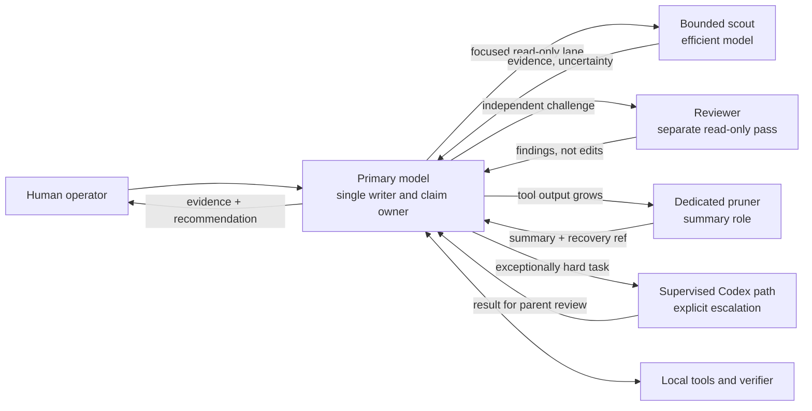
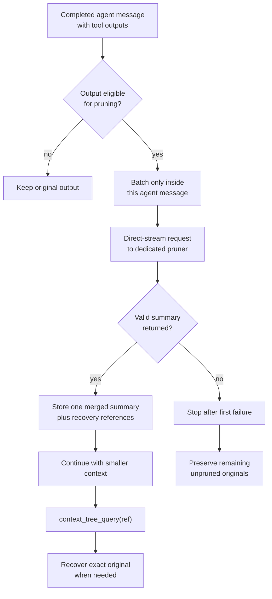
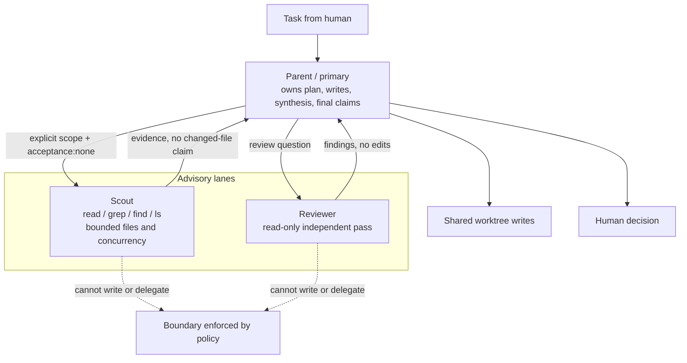
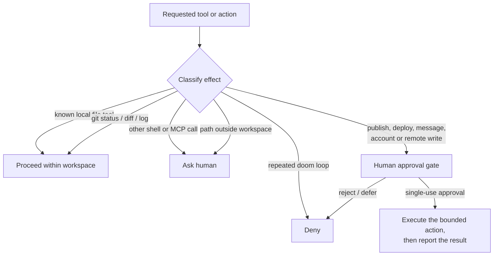
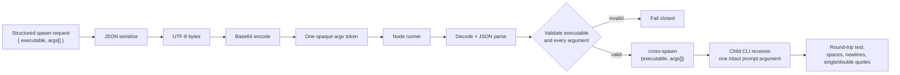
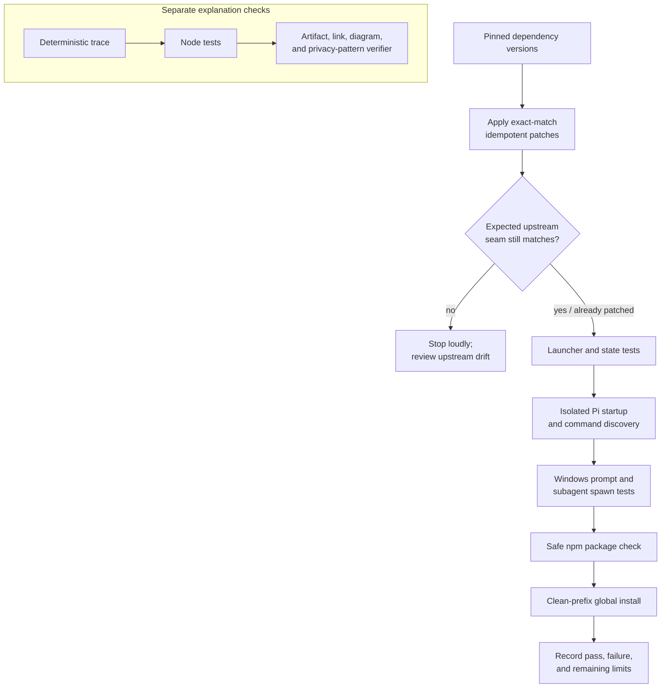

# Architecture

These diagrams describe the operating layer, not a new model runtime. Solid paths are normal flow; decision diamonds are gates; all external effects end with a human.

## Rendered fallbacks

All six Mermaid sources rendered successfully on 2026-07-14. The generated SVGs contain accessible titles/descriptions and no scripts, event handlers, iframes, or external resource references. Use these if the publication platform does not render Mermaid natively:

- [Model routing SVG](../assets/diagrams/model-routing.svg)
- [Context pruning SVG](../assets/diagrams/context-pruning.svg)
- [Subagent boundaries SVG](../assets/diagrams/subagent-boundaries.svg)
- [Permissions SVG](../assets/diagrams/permissions.svg)
- [Windows prompt transport SVG](../assets/diagrams/windows-prompt-transport.svg)
- [Verification lifecycle SVG](../assets/diagrams/verification-lifecycle.svg)

The Mermaid blocks below remain the editable source of truth.

## Model routing

The shipped profile separates the primary from advisory subagents and the supervised exceptional-task path. Crab does not hard-code a provider or model; Pi keeps that choice in the user's authenticated state and `/model` selection.

**Routing rule:** ordinary work stays on the primary. Delegation must buy an independent lane, parallel discovery, or a second opinion—not ceremony.

## Context pruning

The design favors recoverability over maximum compression. Isolation keeps pruning traffic from inheriting the active coding session's private auth/provider state; normalization handles response/session differences at the integration seam. The synthetic demo does not call a pruner; it only checks the published policy shape.

## Subagent boundaries

One shared worktree has one writer. Read-only advisory lanes explicitly use no changed-file acceptance evidence. Ordinary children are not orchestrators; nested delegation requires a concrete, separately bounded design rather than becoming the default.

## Permissions

The shipped policy lives at [`runtime/default-permissions.jsonc`](../runtime/default-permissions.jsonc). It starts with yolo mode off, allows common local coding tools, asks for unknown shell/MCP work and outside-workspace paths, and denies doom loops. The profile separately tells the agent not to inspect or disclose credentials and requires a human decision for external effects. [`permissions.sample.json`](../config/permissions.sample.json) remains an illustrative stricter design, not the runtime policy.

## Windows prompt transport

The workaround avoids constructing a quoted shell command from a multiline prompt. Base64 is transport encoding, **not encryption**. It preserves bytes through Windows argument parsing; permissions and secret handling remain separate concerns.

## Verification lifecycle

`npm run verify:release` runs both lanes and installs the packed tarball under a temporary global prefix. Authentication remains a manual Pi flow and is never created by the verifier.

## Trust boundaries

| Boundary | Inside | Outside / gated |
|---|---|---|
| Workspace | Project source, tests, local tools | `.git`, installed dependencies, user state |
| Agent roles | Primary writer; read-only scout/reviewer | Nested or competing writers |
| Context | Summaries plus recoverable refs | Silent deletion after failed pruning |
| Process transport | Structured argv array | Shell-interpolated multiline prompt |
| Network | Disabled in the demo; lazy documentation/browser tools in real use | Remote write, deployment, publishing, account actions |
| Evidence | Commands actually run and files actually inspected | Usage, productivity, adoption, or model-superiority inference |

## Evidence status

| Element | Status |
|---|---|
| Routing and delegation policy | Shipped in `profiles/crab.md` |
| Windows transport and patch lifecycle | Tested against the pinned installed packages |
| Context-pruning commands and patches | Loaded through Pi RPC discovery; patch seams verified |
| Permission defaults | Shipped with yolo mode off; user changes are preserved |
| MCP configuration | Adapter ships; endpoints remain user-configured through `/mcp setup` |
| Package installation | Packed tarball installed under a clean temporary global prefix |
| End-to-end role trace | Deterministic synthetic explanation, not a live agent transcript |
